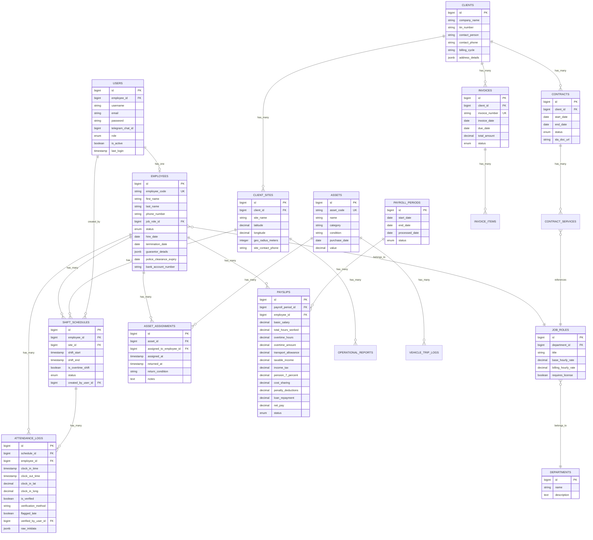
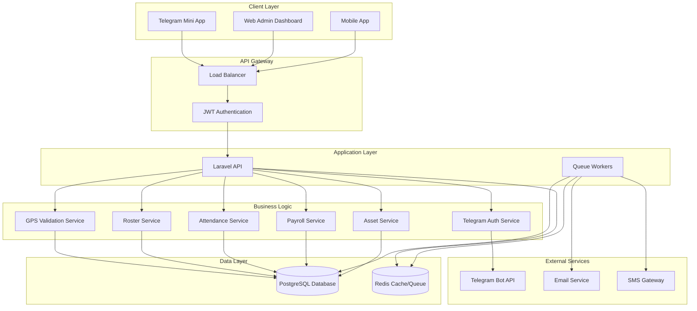
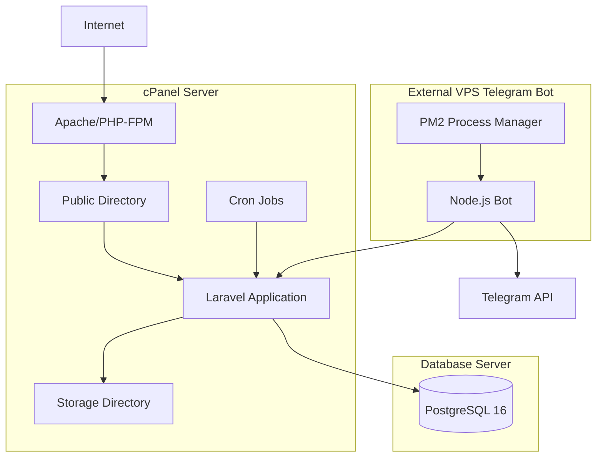

# ALEF DELTA ERP - Entity Relationship Diagram

## Database Schema

```mermaid
erDiagram
    USERS ||--o| EMPLOYEES : "has_one"
    EMPLOYEES }o--|| JOB_ROLES : "belongs_to"
    JOB_ROLES }o--|| DEPARTMENTS : "belongs_to"
    
    EMPLOYEES ||--o{ SHIFT_SCHEDULES : "has_many"
    EMPLOYEES ||--o{ ATTENDANCE_LOGS : "has_many"
    EMPLOYEES ||--o{ ASSET_ASSIGNMENTS : "has_many"
    EMPLOYEES ||--o{ PAYSLIPS : "has_many"
    
    CLIENTS ||--o{ CLIENT_SITES : "has_many"
    CLIENTS ||--o{ CONTRACTS : "has_many"
    CLIENTS ||--o{ INVOICES : "has_many"
    
    CLIENT_SITES ||--o{ SHIFT_SCHEDULES : "has_many"
    CLIENT_SITES ||--o{ OPERATIONAL_REPORTS : "has_many"
    
    CONTRACTS ||--o{ CONTRACT_SERVICES : "has_many"
    CONTRACT_SERVICES }o--|| JOB_ROLES : "references"
    
    SHIFT_SCHEDULES ||--o{ ATTENDANCE_LOGS : "has_many"
    SHIFT_SCHEDULES }o--|| USERS : "created_by"
    
    ASSETS ||--o{ ASSET_ASSIGNMENTS : "has_many"
    ASSETS ||--o{ VEHICLE_TRIP_LOGS : "has_many"
    
    PAYROLL_PERIODS ||--o{ PAYSLIPS : "has_many"
    
    INVOICES ||--o{ INVOICE_ITEMS : "has_many"
    
    USERS {
        bigint id PK
        bigint employee_id FK
        string username
        string email
        string password
        bigint telegram_chat_id
        enum role
        boolean is_active
        timestamp last_login
    }
    
    EMPLOYEES {
        bigint id PK
        string employee_code UK
        string first_name
        string last_name
        string phone_number
        bigint job_role_id FK
        enum status
        date hire_date
        date termination_date
        jsonb guarantor_details
        date police_clearance_expiry
        string bank_account_number
    }
    
    DEPARTMENTS {
        bigint id PK
        string name
        text description
    }
    
    JOB_ROLES {
        bigint id PK
        bigint department_id FK
        string title
        decimal base_hourly_rate
        decimal billing_hourly_rate
        boolean requires_license
    }
    
    CLIENTS {
        bigint id PK
        string company_name
        string tin_number
        string contact_person
        string contact_phone
        string billing_cycle
        jsonb address_details
    }
    
    CLIENT_SITES {
        bigint id PK
        bigint client_id FK
        string site_name
        decimal latitude
        decimal longitude
        integer geo_radius_meters
        string site_contact_phone
    }
    
    CONTRACTS {
        bigint id PK
        bigint client_id FK
        date start_date
        date end_date
        enum status
        string sla_doc_url
    }
    
    SHIFT_SCHEDULES {
        bigint id PK
        bigint employee_id FK
        bigint site_id FK
        timestamp shift_start
        timestamp shift_end
        boolean is_overtime_shift
        enum status
        bigint created_by_user_id FK
    }
    
    ATTENDANCE_LOGS {
        bigint id PK
        bigint schedule_id FK
        bigint employee_id FK
        timestamp clock_in_time
        timestamp clock_out_time
        decimal clock_in_lat
        decimal clock_in_long
        boolean is_verified
        string verification_method
        boolean flagged_late
        bigint verified_by_user_id FK
        jsonb raw_initdata
    }
    
    ASSETS {
        bigint id PK
        string asset_code UK
        string name
        string category
        string condition
        date purchase_date
        decimal value
    }
    
    ASSET_ASSIGNMENTS {
        bigint id PK
        bigint asset_id FK
        bigint assigned_to_employee_id FK
        timestamp assigned_at
        timestamp returned_at
        string return_condition
        text notes
    }
    
    PAYROLL_PERIODS {
        bigint id PK
        date start_date
        date end_date
        date processed_date
        enum status
    }
    
    PAYSLIPS {
        bigint id PK
        bigint payroll_period_id FK
        bigint employee_id FK
        decimal basic_salary
        decimal total_hours_worked
        decimal overtime_hours
        decimal overtime_amount
        decimal transport_allowance
        decimal taxable_income
        decimal income_tax
        decimal pension_7_percent
        decimal cost_sharing
        decimal penalty_deductions
        decimal loan_repayment
        decimal net_pay
        enum status
    }
    
    INVOICES {
        bigint id PK
        bigint client_id FK
        string invoice_number UK
        date invoice_date
        date due_date
        decimal total_amount
        enum status
    }
```

## System Architecture

```mermaid
graph TB
    subgraph "Client Layer"
        TG[Telegram Mini App]
        WEB[Web Admin Dashboard]
        MOB[Mobile App]
    end
    
    subgraph "API Gateway"
        LB[Load Balancer]
        AUTH[JWT Authentication]
    end
    
    subgraph "Application Layer"
        API[Laravel API]
        WORKER[Queue Workers]
    end
    
    subgraph "Business Logic"
        GPS[GPS Validation Service]
        ROST[Roster Service]
        ATT[Attendance Service]
        PAY[Payroll Service]
        ASSET[Asset Service]
        TGAUTH[Telegram Auth Service]
    end
    
    subgraph "Data Layer"
        PG[(PostgreSQL Database)]
        REDIS[(Redis Cache/Queue)]
    end
    
    subgraph "External Services"
        TGAPI[Telegram Bot API]
        EMAIL[Email Service]
        SMS[SMS Gateway]
    end
    
    TG --> LB
    WEB --> LB
    MOB --> LB
    
    LB --> AUTH
    AUTH --> API
    
    API --> GPS
    API --> ROST
    API --> ATT
    API --> PAY
    API --> ASSET
    API --> TGAUTH
    
    GPS --> PG
    ROST --> PG
    ATT --> PG
    PAY --> PG
    ASSET --> PG
    
    API --> REDIS
    WORKER --> REDIS
    WORKER --> PG
    
    TGAUTH --> TGAPI
    WORKER --> EMAIL
    WORKER --> SMS
```

## Deployment Architecture (cPanel)

```mermaid
graph TB
    subgraph "cPanel Server"
        APACHE[Apache/PHP-FPM]
        LARAVEL[Laravel Application]
        PUBLIC[Public Directory]
        STORAGE[Storage Directory]
        CRON[Cron Jobs]
    end
    
    subgraph "Database Server"
        PG[(PostgreSQL 16)]
    end
    
    subgraph "External VPS Telegram Bot"
        BOT[Node.js Bot]
        PM2[PM2 Process Manager]
    end
    
    INTERNET[Internet] --> APACHE
    APACHE --> PUBLIC
    PUBLIC --> LARAVEL
    LARAVEL --> PG
    LARAVEL --> STORAGE
    CRON --> LARAVEL
    
    BOT --> TELEGRAM[Telegram API]
    BOT --> LARAVEL
    PM2 --> BOT
```
